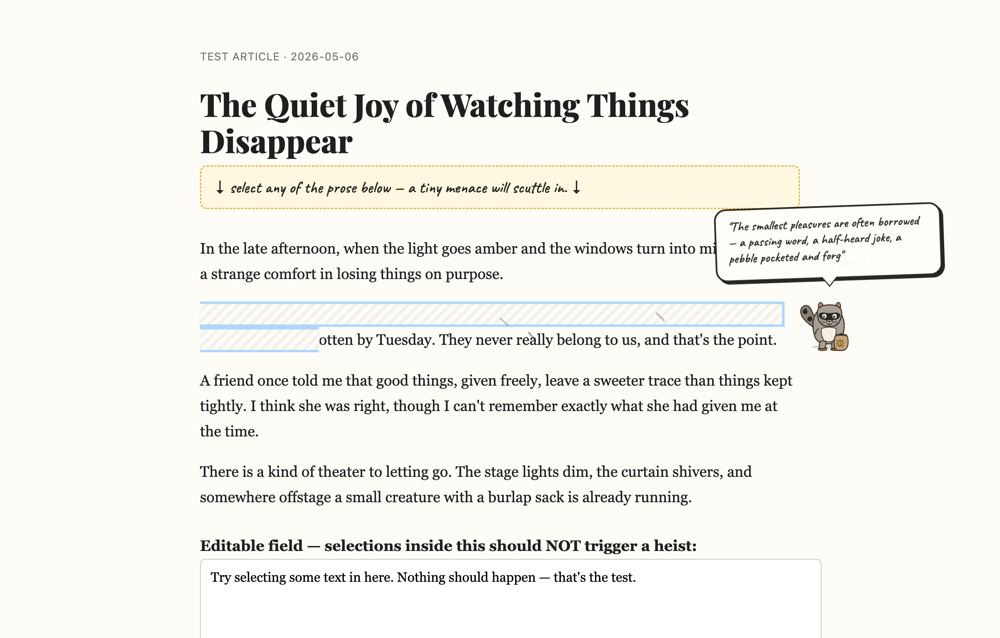
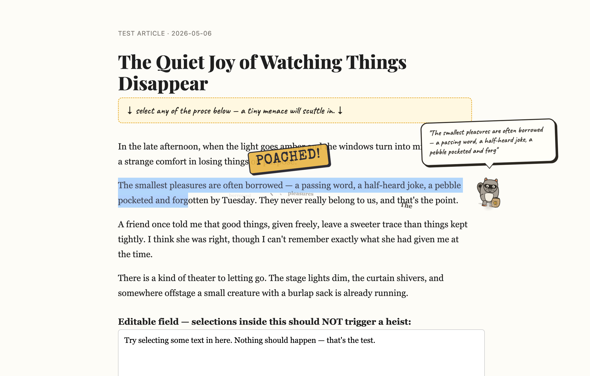
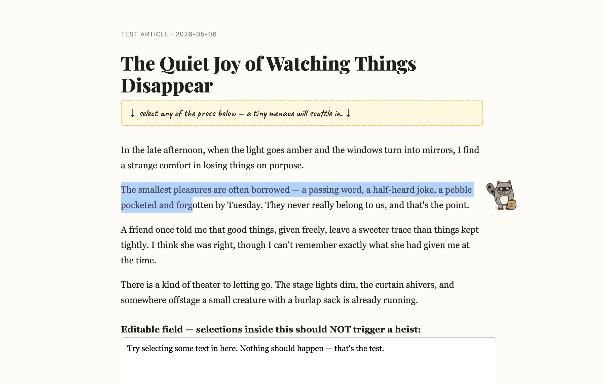
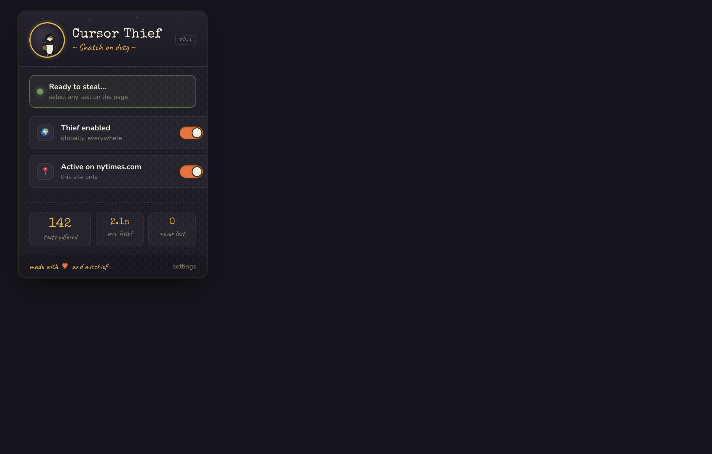
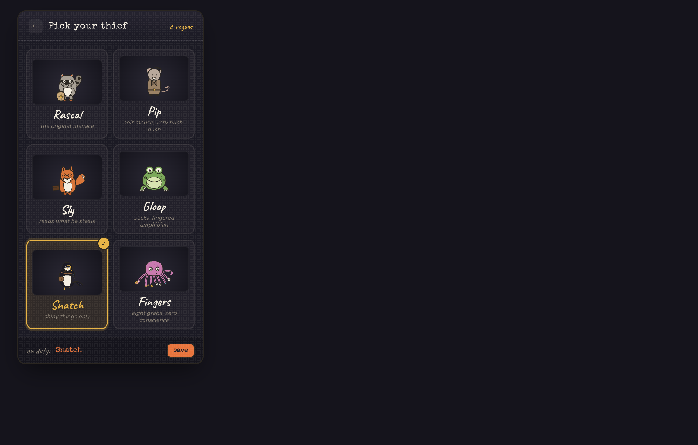

# Cursor Thief

> *A tiny creature scuttles in, steals your selected text, runs off with it, and brings it back.*

A browser extension that turns any text selection into a moment of unexpected delight. Pick a thief, highlight some prose, and watch one of six tiny menaces sneak in, grab your words, and disappear off-screen — only to come back a few seconds later with an apologetic sparkle. **Your text is never actually lost** — the page DOM is never touched, so `Cmd/Ctrl+C` keeps working through the whole heist.



| Steal moment | Scampering | Popup | Picker |
|---|---|---|---|
|  |  |  |  |

---

## Repo layout

```
cursor-thief/
├── cursor-thief.md            ← original concept + spec
├── designs/                   ← original React/JSX design canvas (Babel-standalone)
│   ├── Cursor Thief.html      ← open this in a browser to view the design boards
│   ├── creature.jsx           ← multi-pose Rascal (idle/run/carry/drop)
│   ├── creatures-roster.jsx   ← all 6 thieves
│   ├── popup.jsx, picker.jsx, storyboard.jsx, design-canvas.jsx
├── docs/superpowers/specs/    ← implementation design doc
└── extension/                 ← the actual shipped extension (Vite + TypeScript)
    ├── src/                   ← source
    ├── manifest.chromium.json
    ├── manifest.firefox.json
    ├── scripts/build.mjs      ← cross-browser build orchestrator
    ├── test/index.html        ← local test harness (load in any browser)
    └── dist/                  ← built output, generated by `npm run build`
```

---

## Quick start — install the built extension

After running `npm run build` (see [Build it yourself](#build-it-yourself)), the unpacked extension will live at:

- `extension/dist/chromium/` — for Chrome, Edge, Brave, Arc, Opera, Vivaldi
- `extension/dist/firefox/` — for Firefox

### Chrome / Edge / Brave / Arc / Opera / Vivaldi

1. Open `chrome://extensions` (or `edge://extensions`, `brave://extensions`, etc.).
2. Toggle **Developer mode** on (top-right).
3. Click **Load unpacked**.
4. Select the folder `extension/dist/chromium/`.
5. The Cursor Thief icon appears in your toolbar.

### Firefox

1. Open `about:debugging#/runtime/this-firefox`.
2. Click **Load Temporary Add-on…**.
3. Select **any** file inside `extension/dist/firefox/` (e.g. `manifest.json`).
4. The Cursor Thief icon appears in your toolbar.

> **Note:** Firefox treats unsigned MV3 extensions as "temporary" — they unload when Firefox restarts. To install permanently you'd need to sign the build at [addons.mozilla.org](https://addons.mozilla.org).

---

## Using it

1. Click the toolbar icon to open the popup.
2. Make sure the **Thief enabled** toggle is on.
3. Select any text on any web page. Within a second a creature scuttles in, fades the selection, runs off with a speech bubble, and brings the text back.
4. The toolbar popup tracks your stats: *texts pilfered*, *avg. heist time*, and a defiant *0 never lost*.

### Pick a different thief

Click the mascot circle in the popup header (or the *settings* link in the footer) to open the picker. Six characters are bundled:

| | Name | Personality |
|--|---|---|
| 🦝 | **Rascal** | the original menace |
| 🐭 | **Pip** | noir mouse, very hush-hush |
| 🦊 | **Sly** | reads what he steals |
| 🐸 | **Gloop** | sticky-fingered amphibian |
| 🐦 | **Snatch** | shiny things only |
| 🐙 | **Fingers** | eight grabs, zero conscience |

Selection auto-saves the moment you click a card. Hit *save* (or the back arrow) to return to the main view.

### Disable on a specific site

In the popup, the **Active on `<domain>`** toggle controls per-site behaviour. Switch it off and the thief naps on that domain only — global settings stay intact. Settings are synced to your browser profile via `browser.storage.sync`, so toggling on one device follows you to the others.

### Reading time (post-steal linger)

After the heist's "POACHED!" moment, the thief stays planted with the speech bubble showing your stolen text — long enough to actually read it. The popup has a **Reading time** picker with five presets:

- **no pause** — thief grabs and immediately runs (fastest, original behaviour)
- **quick (1s)** — glance time
- **comfy (1.8s)** — default; reads short selections naturally
- **patient (3s)** — long enough for full sentences
- **leisurely (5s)** — for paragraphs / when you want to admire the heist

The selection stays "scraped off the page" the entire time. Once the linger expires (or you close the bubble visually by triggering another action), the thief scampers off and a moment later returns to restore the text.

---

## Where the thief stays out of the way

| Situation | Behaviour |
|---|---|
| Selection inside `<input>`, `<textarea>`, or `[contenteditable]` | **Ignored** — never disrupts active writing. |
| Cross-origin `<iframe>` | **Ignored** — top frame only. |
| You select something while a heist is already in flight | **Ignored** — one heist at a time. |
| Selection is so long the bubble can't show it | **Truncated** to ~140 characters with an ellipsis. The original is never modified, so the full text is still copyable. |
| You scroll mid-heist | The creature drifts gracefully — best effort, intentionally not perfect. |
| You hit `Cmd/Ctrl+C` mid-heist | Works. The fade is purely a visual overlay; the underlying selection range is untouched. |

---

## Build it yourself

Requirements: **Node 18+** and **npm**.

```bash
cd extension
npm install
npm run build           # builds both targets to dist/{chromium,firefox}/
npm run build:chromium  # one target
npm run build:firefox   # one target
npm run typecheck       # tsc --noEmit
npm run dev             # watch mode for the chromium target
npm run clean           # rm -rf dist
```

Output goes to `extension/dist/<target>/` ready to load unpacked.

---

## Local test harness (no install needed)

Want to see the heist without installing the extension? There's a stand-alone test page that stubs the browser-extension APIs in plain page script:

```bash
cd extension
npm run build:chromium                        # at least once
open test/index.html                          # macOS
# or: xdg-open test/index.html (Linux), start test/index.html (Windows)
```

Select any of the prose paragraphs on the page and the heist runs. Selecting inside the textarea correctly does nothing.

---

## Tweaking it

Most of the personality lives in a few places. None of these need a deep rebuild — just edit the file, run `npm run build`, and reload the unpacked extension at `chrome://extensions`.

### 1. Animation timing — `extension/src/shared/constants.ts`

```ts
export const TIMINGS = {
  ARRIVE_MS: 700,    // creature scurries from off-screen edge to selection
  STEAL_MS: 300,     // selection scrapes off, speech bubble pops, "YOINK!" burst
  EXIT_MS: 600,      // creature + bubble fly off-screen
  WAIT_MS: 1500,     // dramatic pause with stolen text
  RETURN_MS: 600,    // creature comes back from the other side
  RESTORE_MS: 400,   // selection un-scrapes, sparkles, exit
};
export const MAX_BUBBLE_CHARS = 140;
```

The post-steal linger duration is a **runtime setting** (not a constant) — the user picks from presets in the popup. Default is 1.8s. To change the available presets, edit `LINGER_PRESETS` in `src/shared/types.ts`.

Total worst-case heist (with the longest 5s linger): ~9 seconds. Spec says text comes back within 5–6 s, but that's measured from when the user *stops* reading; the linger explicitly extends the visible-loot window because users asked for it.

### 2. Add or replace a character

Each thief is a single file under `extension/src/content/creatures/<name>.ts` that builds an SVG via the tiny `h(tag, attrs, children)` helper. To add a new character:

1. Copy `rascal.ts` to `mychar.ts` and rewrite the SVG paths.
2. Register it in `extension/src/content/creatures/index.ts` and add an entry to `extension/src/shared/types.ts` (`CharacterId`, `CHARACTER_IDS`, `CHARACTERS`).
3. The popup's picker auto-discovers from `CHARACTER_IDS` — no UI changes needed.

### 3. Speech bubble look

`extension/src/content/overlay.ts` has the `.bubble` rule. Tweak `font-family`, `border`, `box-shadow`, etc. The default leans on `'Caveat'` with a `'Marker Felt'` fallback — the host page's CSP decides whether Caveat actually loads, which is fine since the fallback is also handwriting-y on macOS.

### 4. Palette

`extension/src/shared/constants.ts` exports `PALETTE` (ink, paper, amber, mustard, midnight). Most popup styling is inline in `App.tsx` and `Picker.tsx` though — a global theme refactor is left as an exercise.

### 5. Default character / start-disabled / default linger

`extension/src/shared/types.ts`:

```ts
export const DEFAULT_SETTINGS: Settings = {
  enabled: true,                  // flip to false to ship a "calm by default" build
  selectedCharacter: "rascal",    // any CharacterId
  perSiteOverrides: {},
  lingerMs: 1800,                 // post-steal pause; 0 = no pause
};

export const LINGER_PRESETS = [   // shown as chips in the popup
  { label: "no pause", value: 0 },
  { label: "quick (1s)", value: 1000 },
  { label: "comfy (1.8s)", value: 1800 },
  { label: "patient (3s)", value: 3000 },
  { label: "leisurely (5s)", value: 5000 },
];
```

### 6. Scrape texture / paper colour

The "text gets scraped off the page" effect lives in `src/content/overlay.ts` under `.cover`. It uses the page's actual background colour (sampled at heist start via `setPaperColor` in `heist.ts`) so the cover blends with the host page rather than always being white. The diagonal stripe pattern that makes it read as "scraped paper" is set as a `repeating-linear-gradient` in the same rule — adjust the angle (`135deg`) or the stripe spacing if you want a different texture.

---

## Troubleshooting

**Q: I loaded the extension but selecting text does nothing.**
- Check the popup says **Ready to steal…** (green pill). If it says **Snoozing**, one of the toggles is off.
- Reload the page after installing — content scripts only attach on subsequent loads.
- Some pages set their own CSP that blocks all extension content scripts (rare). The extension can't help there.

**Q: The popup font looks like Times New Roman.**
- The popup loads Google Fonts over HTTPS. If you're offline or behind a strict firewall, the Caveat / Special Elite / Nunito fonts won't fetch and you'll see system fallbacks. The layout still works.

**Q: Toolbar icon is a blank square.**
- The build emits placeholder 1×1 PNGs at `dist/<target>/icons/icon-{16,32,48,128}.png`. To use real icons, drop your own files at `extension/public/icons/icon-{16,32,48,128}.png` before running `npm run build`.

**Q: Firefox unloads the extension every time I restart.**
- That's how `about:debugging` temporary add-ons work. Sign the build at addons.mozilla.org for permanent install.

**Q: The thief doesn't trigger inside Gmail / Google Docs / Slack web.**
- Those apps live inside cross-origin iframes or use `contenteditable`, both of which the spec explicitly skips. By design.

**Q: Can I steal images / links / non-text?**
- No, by design (out of spec). The thief only takes prose.

**Q: Where is data stored?**
- Settings (toggles, picked character, per-site disables): `browser.storage.sync` — synced via your browser profile, ~8KB cap, never leaves the browser.
- Stats (steal count, avg heist time): `browser.storage.local` — device-only.
- No telemetry, no external servers, no analytics. The thief never persists what it steals.

---

## Project status / roadmap

Current version: **0.1.0** — first cut. The spec from `cursor-thief.md` is met; all six characters render; per-site disable works.

Possible additions (none in scope today):
- Real signed icons.
- Optional sound effects (the spec deliberately excluded these).
- Hover tooltip on the toolbar icon showing today's heist count.
- Cmd/Ctrl-click on a character card to favourite multiple → random rotation.
- An options page for power-user settings (only the popup exists today).

---

## Credits

- Concept and design: see `designs/` and `cursor-thief.md`.
- Built with Vite, TypeScript, React 18, and `webextension-polyfill`.
- Fonts: Caveat, Special Elite, Nunito (Google Fonts), Playfair Display (test page only).
